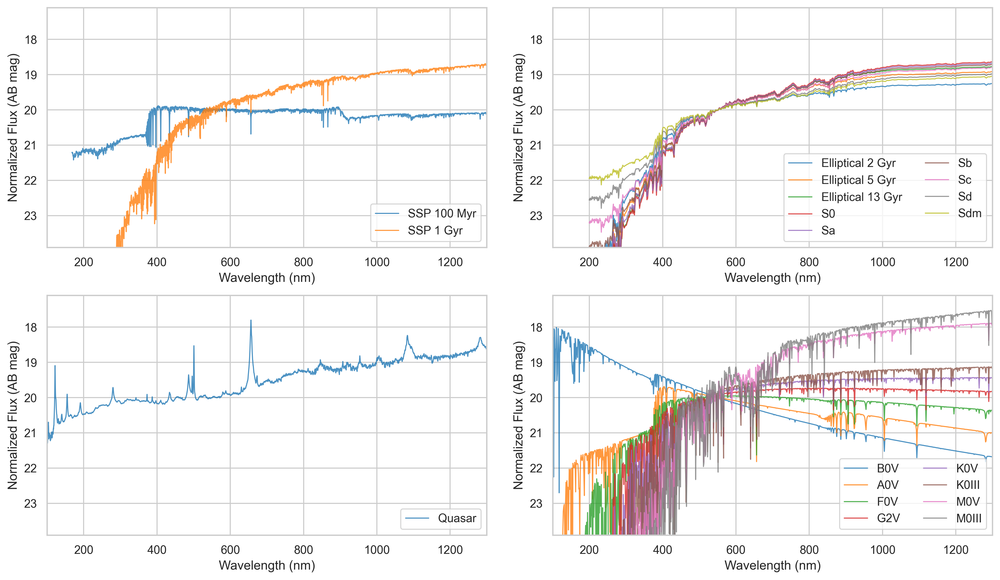

# Input Panel

For the detail of the input paramters, please see the documentation in the top and `src` directories of [PFS Exposure Time Calculator and Spectrum Simulator](https://github.com/Subaru-PFS/spt_ExposureTimeCalculator/).

## Target tab

### Target Information

#### Template Spectrum

Dropdown list of template spectra. Currently, the following templates are available.

##### Galaxy

###### SSP

- Star-forming galaxy (E-MILES SSP, 100Myr, $Z_\odot$, Chabrier IMF)
    - Valid wavelength range is 168 nm to 5000 nm.
- Quiescent galaxy (E-MILES SSP, 1Gyr, $Z_\odot$, Chabrier IMF)
    - Valid wavelength range is 168 nm to 5000 nm.

###### SWIRE Template Library

Templates for elliptical and spiral galaxies from [the SWIRE Template Library](http://www.iasf-milano.inaf.it/~polletta/templates/swire_templates.html) are available. Note that the spectral resolution of the templates are much lower than the PFS resolution.

The following galaxy types ara available.

- Elliptical galaxies: 2 Gyr, 5 Gyr, and 13 Gyr
- Spiral galaxies: S0, Sa, Sb, Sc, Sd, Sdm

##### Quasar

- Composite ([Vanden Berk+2001 and Glikman+2006](https://www.stsci.edu/hst/instrumentation/reference-data-for-calibration-and-tools/astronomical-catalogs/composite-qso-spectra-for-nir))
    - Valid wavelength range is 86nm and 3520 nm

##### Star

$T_\mathrm{eff}$ and $\log g$ are taken from Table 2 in the following [README](https://archive.stsci.edu/hlsps/reference-atlases/cdbs/grid/ck04models/AA_README).
Valid wavelength range is 100 nm to 10000 nm.

| Template | Library             | $T_\mathrm{eff}$ (K) | $\log g$ |       $Z$ |
|----------|---------------------|---------------------:|---------:|----------:|
| B0V      | BT-Settl (AGSS2009) |                30000 |      4.0 | $Z_\odot$ |
| A0V      | BT-Settl (AGSS2009) |                 9600 |      4.0 | $Z_\odot$ |
| F0V      | BT-Settl (AGSS2009) |                 7200 |      4.5 | $Z_\odot$ |
| G2V      | BT-Settl (AGSS2009) |                 5900 |      4.5 | $Z_\odot$ |
| K0V      | BT-Settl (AGSS2009) |                 5200 |      4.5 | $Z_\odot$ |
| M0V      | BT-Settl (AGSS2009) |                 3800 |      4.5 | $Z_\odot$ |
| K0III    | BT-Settl (AGSS2009) |                 4800 |      2.0 | $Z_\odot$ |
| M0III    | BT-Settl (AGSS2009) |                 3700 |      1.5 | $Z_\odot$ |

##### Misc

- Flat $F_\nu$

<figure markdown="span">

<figcaption>Template spectra: (Upper Left) SSP; (Upper Right) SWIRE templates; (Lower Left) Quasar; (Lower Right) Stars</figcaption>
</figure>

#### Magnitude

AB magnitude to be normalized to.

#### Wavelength

_Observed-frame_ wavelength in nm where the template is normalized.
Note that the value must be within the valid wavelength ranges mentioned above _after_ applying the redshift.

#### Redshift

Redshift to be applied to the spectrum.

### Emission Line Properties

#### Line flux

Emission line flux in $\mathrm{erg}\ \mathrm{s}^{-1}\ \mathrm{cm}^{-2}$.
Note that the emission line S/N is computed based on the noise vector including the template continuum.
If you want to know continuum-free, emission line-only S/N, you may want to set the target magnitude to a large value.

#### Line width sigma

Emission line velocity dispersion $\sigma$ in km/s.

### Custom Input Spectrum

Input spectrum must be in a CSV format with exactly two columns.
The first column must be the wavelength in [Å] and
the second column must be the flux in [$\mathrm{erg}$ $\mathrm{s}^{-1}$ $\mathrm{cm}^{-2}$ $\mathrm{Å}^{-1}$]
No header line is needed and lines starting with "#" are regarded as commment.
An [example CSV file](https://gist.github.com/monodera/be48be04f376b2db268d0b14ad9cb5e1) is available.

### Miscellaneous Information

#### Effective radius

Effective radius of the target in arcsec.

#### Galactic Extinction E(B-V)

$E(B-V)$ for Galactic extinction in magnitude. An extinction curve by Weingartner & Drain (2001) is used.

## Condition tab

#### Seeing FWHM

Seeing FWHM in arcsec.

#### Throughput Degradation Factor

Throughput degradation factor.
The output spectrum will be multiplied by this factor.

#### Moon Zenith Angle

Zenith angle of the Moon in degrees.

#### Moon Separation to Target

Distance between the Moon and the target in degrees.

#### Moon Phase

New, quarter, and half moon is defined as the Moon Phase = 0, 0.25, and 0.5, respectively.

## Instrument tab

#### Integration Time per Exposure

Exposure time per exposure in seconds.

#### Number of exposures

How many integrations are made with the exposure time set above.

#### Distance from FoV center

The value 0 is for the PFS FoV center, while 0.675 is the edge.

## Telescope tab

#### Zenith Angle

Zenith angle in degrees (0 at zenith).

## Nominal Observing Condition

The nominal observing condition as a reference to calculate the effective exposure time is the following.
See the Call for Proposal for the current definition.

| Parameter                 | Value | Unit   |
|---------------------------|------:|--------|
| Seeing FWHM               |   0.8 | arcsec |
| Throughput                |   0.9 |        |
| Moon Zenith Angle         |    30 | deg    |
| Moon Separation to Target |    60 | deg    |
| Moon Phase                |     0 |        |
| Distance from FoV center  |  0.45 | deg    |
| Telescope Zenith Angle    |    45 | deg    |

