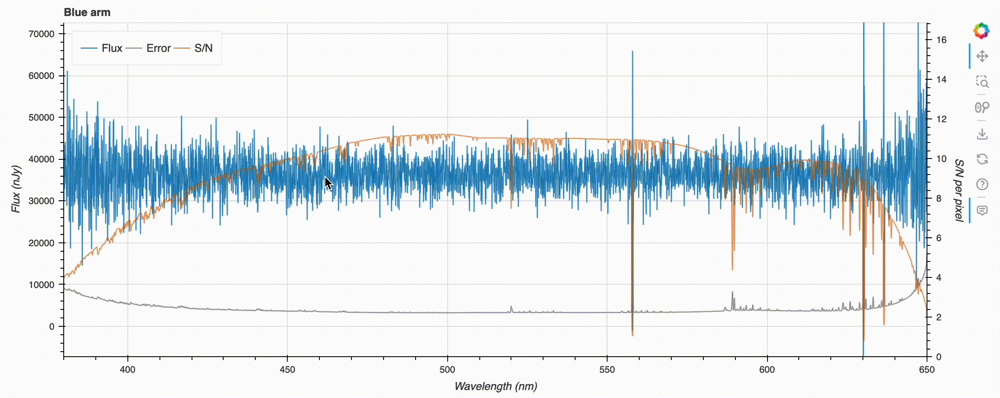

# Outputs

## Downloads

Once the calculation is finished. Four buttons will be shown at the right panel for two categories as follows.
The files are in FITS binary table format and [Enhanced Character-Separated Values (ECSV) format](https://github.com/astropy/astropy-APEs/blob/main/APE6.rst) which can be easily read by astropy or other common libraries.

For the detail of the content, please refer the `README` of [PFS Exposure Time Calculator and Spectrum Simulator](https://github.com/Subaru-PFS/spt_ExposureTimeCalculator/) as well.

### Simulated spectrum

Files for the simulated spectrum contain the following columns.

| name       | unit    | datatype | description                      |
|------------|---------|----------|----------------------------------|
| wavelength | nm      | float64  | Wavelength in vacuum             |
| flux       | nJy     | float64  | Flux                             |
| error      | nJy     | float64  | Error                            |
| sn         | 1 / pix | float64  | S/N per pixel                    |
| flux_input | nJy     | float64  | Input flux                       |
| sky        | nJy     | float64  | Sky                              |
| mask       |         | bool     | Masked if True                   |
| arm        |         | int64    | Arm ID (0=blue 1=red 2=nir 3=mr) |
| pixel      |         | int64    | Pixel ID in each arm             |

The following metadata from the inputs are also included.

| name     | description                                                    |
|----------|----------------------------------------------------------------|
| TMPLSPEC | Template type                                                  |
| TMPL_MAG | AB mag to normalize template (`None` for custom input)         |
| TMPL_WAV | Wavelength for normalizing template  (`None` for custom input) |
| TMPL_Z   | Reshift of the template   (`None` for custom input)            |
| R_EFF    | Effective radius of the target                                 |
| EXPTIME  | Total exposure time                                            |
| EXPTIME1 | Single exposure time                                           |
| EXPNUM   | Number of exposures                                            |
| SEEING   | Seeing FWHM                                                    |
| ZANG     | Zenith angle                                                   |
| MOON-ZA  | Moon zenith angle                                              |
| MOON-SEP | Moon-target separation                                         |
| MOON-PH  | Moon phase (0=new, 0.25=quater, 1=new)                         |
| FLDANG   | PFS field angle (center=0, edge=0.675)                         |
| DEGRADE  | Throughput degradation factor                                  |
| GAL_EXT  | E(B-V) of Galactive extinction                                 |
| MED_RES  | `True` if medium resolution mode                               |

### Emission line S/N

Files for the emission line S/N contain the following columns.

| name                      | unit | datatype | description                          |
|---------------------------|------|----------|--------------------------------------|
| wavelength                | nm   | float64  | Wavelength in vacuum                 |
| fiber_aperture_factor     |      | float64  | Fiber aperture factor                |
| effective_collecting_area | m2   | float64  | Effective collecting area            |
| snline_b                  |      | float64  | Emission line S/N in the blue arm    |
| snline_r                  |      | float64  | Emission line S/N in the red arm     |
| snline_n                  |      | float64  | Emission line S/N in the near-IR arm |
| snline_tot                |      | float64  | Total emission line S/N              |

The following metadata from the inputs are also included.

| name     | description                                                    |
|----------|----------------------------------------------------------------|
| EL_FLUX  | Emission line flux (erg/s/cm^2/A)                              |
| EL_SIG   | Emission line velocity dispersion sigma (km/s)                 |
| TMPLSPEC | Template type                                                  |
| TMPL_MAG | AB mag to normalize template (`None` for custom input)         |
| TMPL_WAV | Wavelength for normalizing template  (`None` for custom input) |
| TMPL_Z   | Reshift of the template   (`None` for custom input)            |
| R_EFF    | Effective radius of the target                                 |
| EXPTIME  | Total exposure time                                            |
| EXPTIME1 | Single exposure time                                           |
| EXPNUM   | Number of exposures                                            |
| SEEING   | Seeing FWHM                                                    |
| ZANG     | Zenith angle                                                   |
| MOON-ZA  | Moon zenith angle                                              |
| MOON-SEP | Moon-target separation                                         |
| MOON-PH  | Moon phase (0=new, 0.25=quater, 1=new)                         |
| FLDANG   | PFS field angle (center=0, edge=0.675)                         |
| DEGRADE  | Throughput degradation factor                                  |
| GAL_EXT  | E(B-V) of Galactive extinction                                 |
| MED_RES  | `True` if medium resolution mode                               |

## Plots

Five panels will be shown for blue arm, red arm, near-IR arm, medium-resolution arm, and emission line S/N.
You can click the legend to highlight or mute lines of your interest.

You can also zoom, pan, etc. by using the Bokeh tooltips located at the right side of each plot.

<!--  -->

